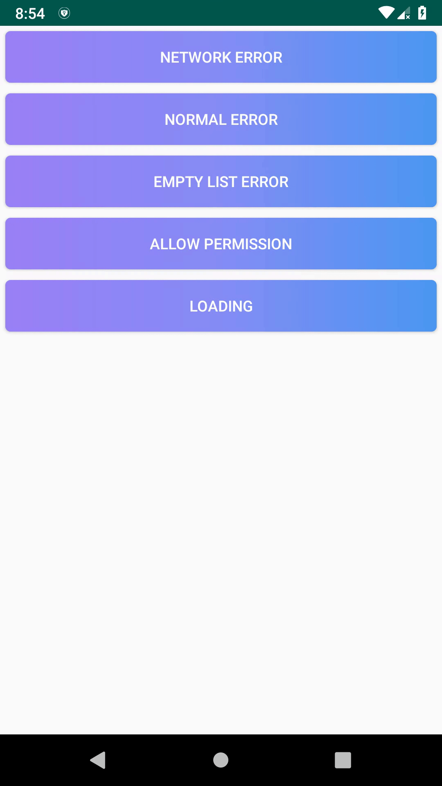
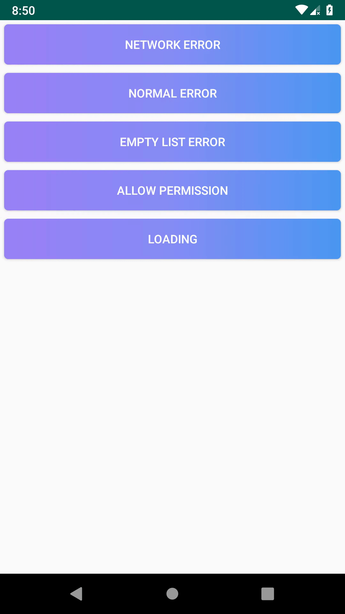
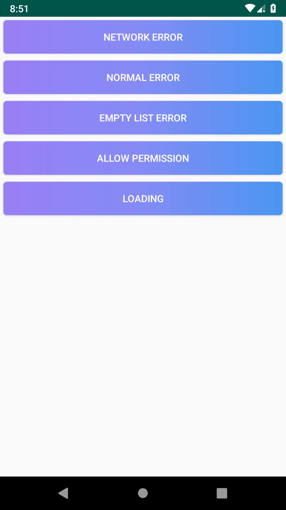
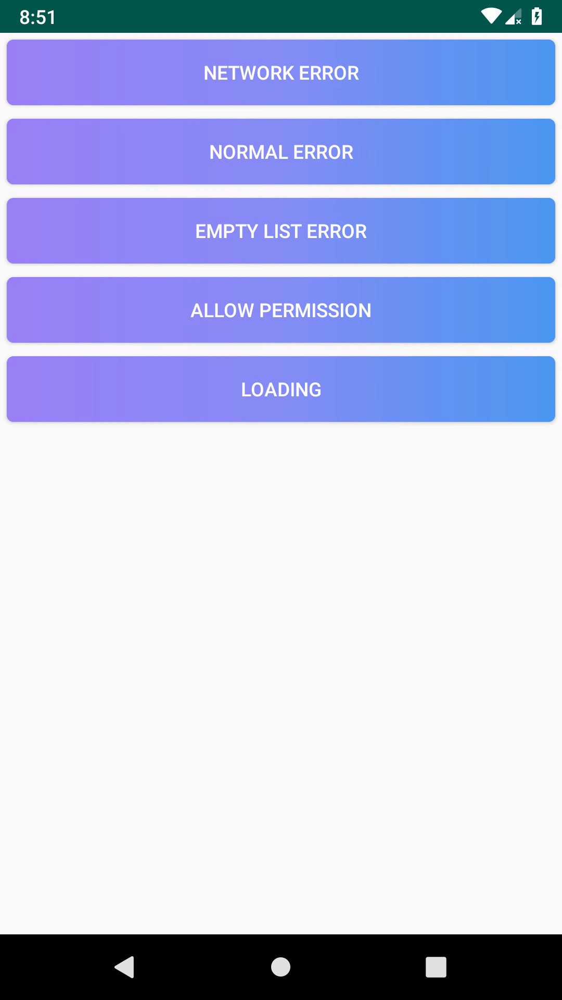
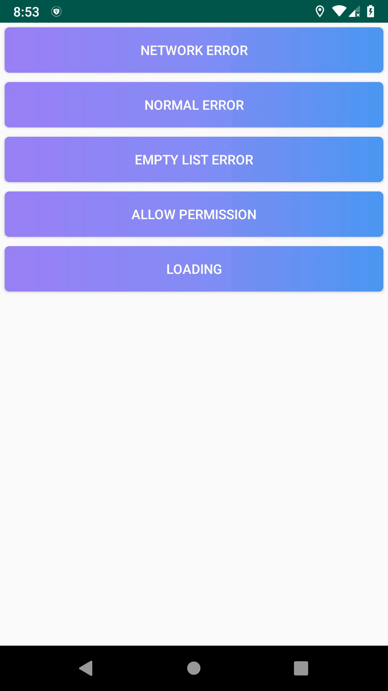

# Progress View


## What Works

##### The layout makes it easy to control during the process..

##### Loading Example


##### Network Example


##### Error Example


##### Empty List Example


##### Permission Example


### How to Import
##### Step 1. Add the JitPack repository to your build file
```java
allprojects {
    repositories {
        maven { url 'https://jitpack.io' }
    }
}
```

##### Step 2. Add the dependency
```java
dependencies {
    implementation 'com.github.iamkurtgoz:ProgressView:1.0'
}
```
[](https://jitpack.io/#iamkurtgoz/ProgressView)

## What Works
```xml
<?xml version="1.0" encoding="utf-8"?>
<com.iamkurtgoz.progressview.ProgressView
    xmlns:android="http://schemas.android.com/apk/res/android"
    xmlns:app="http://schemas.android.com/apk/res-auto"
    xmlns:tools="http://schemas.android.com/tools"
    android:id="@+id/progressLayout"
    android:layout_width="match_parent"
    android:layout_height="match_parent"
    android:gravity="center"
    android:orientation="vertical">

    -----

</com.iamkurtgoz.progressview.ProgressView>
```

```java
ProgressView progressView = (ProgressView) findViewById(R.id.progressLayout);
progressView.pushLoading().pushEmptyListView("Loading. Please Wait!");
```
# CONTACT : kurtgozmehmet159@gmail.com
